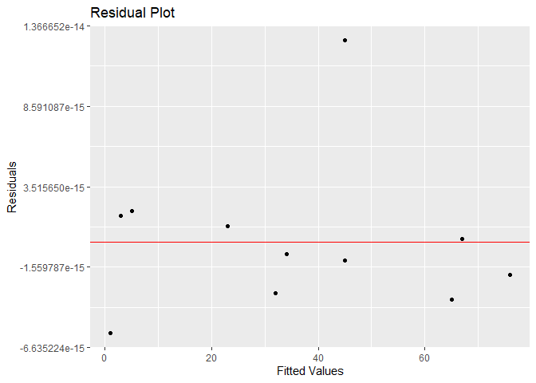
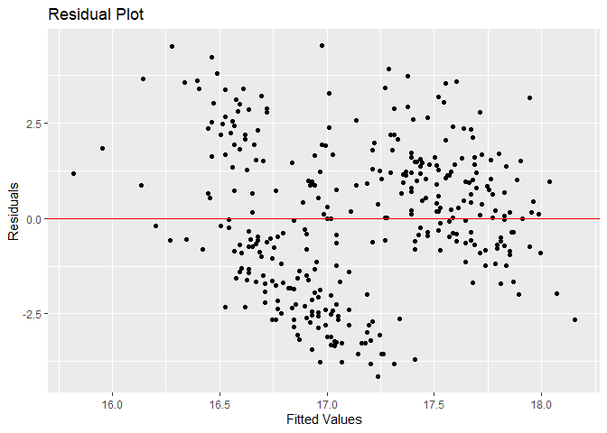
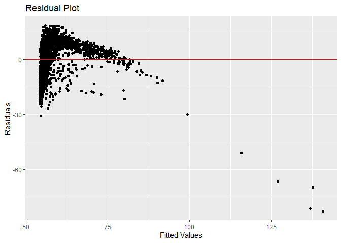

<!-- README.md is generated from README.Rmd. Please edit that file -->

# ResidualPlot

<!-- badges: start -->
<!-- badges: end -->

The goal of ResidualPlot is to make a residual plot for a simple linear
model. It contains the function *residual_plot* which makes a residual
plot for the data given.

## Installation

You can install the development version of ResidualPlot from
[Github](https://github.com/) with:

``` r
# install.packages("devtools")
devtools::install_github("stat545ubc-2023/ResidualPlot")
```

## Example

This is a basic example which shows you how to solve a common problem:

``` r
library(ResidualPlot)
# Example 1
x <- c(2,45,6,73,24,4,23,5,645,23,34,65) #random numbers
y <- c(32,45,1,34,5,67,3,45,65,76,45,23) #random numbers
test <- data.frame(x,y) #make data to use
residual_plot(test,test$x,test$y) #it plots
```



``` r

# Example 2
library(palmerpenguins)
residual_plot(penguins, penguins$bill_depth_mm, penguins$bill_length_mm) #trying with penguins
```



``` r

# Example 3
library(gapminder)
residual_plot(gapminder, gapminder$lifeExp,gapminder$gdpPercap) #trying with gapminder
```


